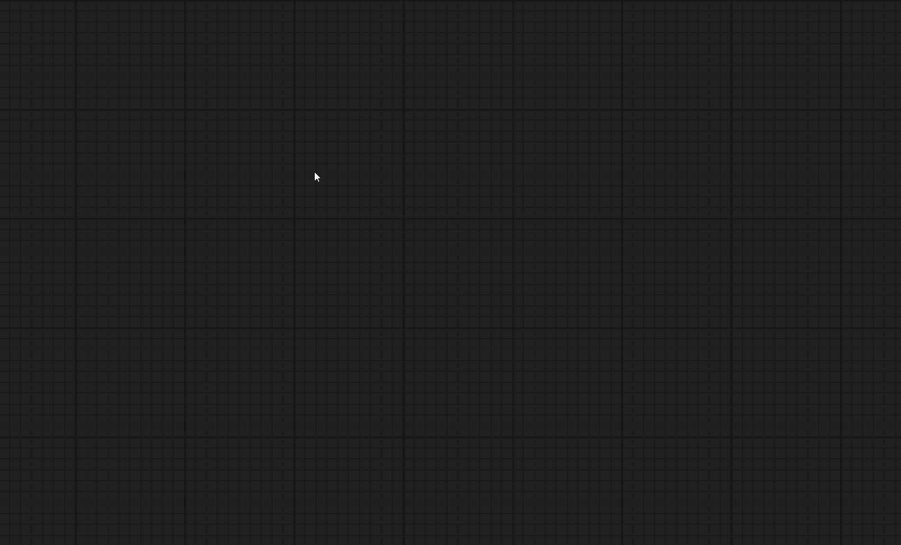
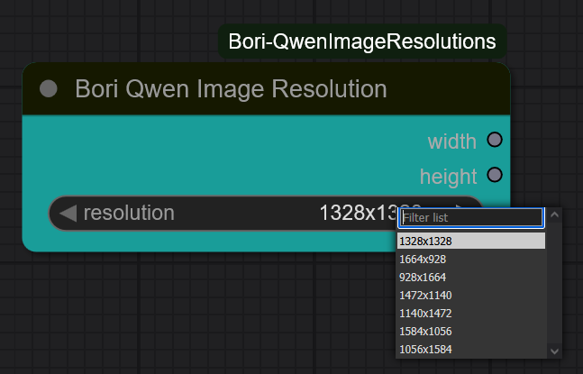

# ComfyUI-Bori-QwenImageResolutions 
This is a custom node for ComfyUI that provides the user with a dropdown which contains the recommended resolutions for the Qwen Image Model.

 
 
## Installation
Clone into your `custom_nodes/` folder inside ComfyUI: 
git clone https://github.com/boricuapab/ComfyUI-Bori-QwenImageResolutions.git 
